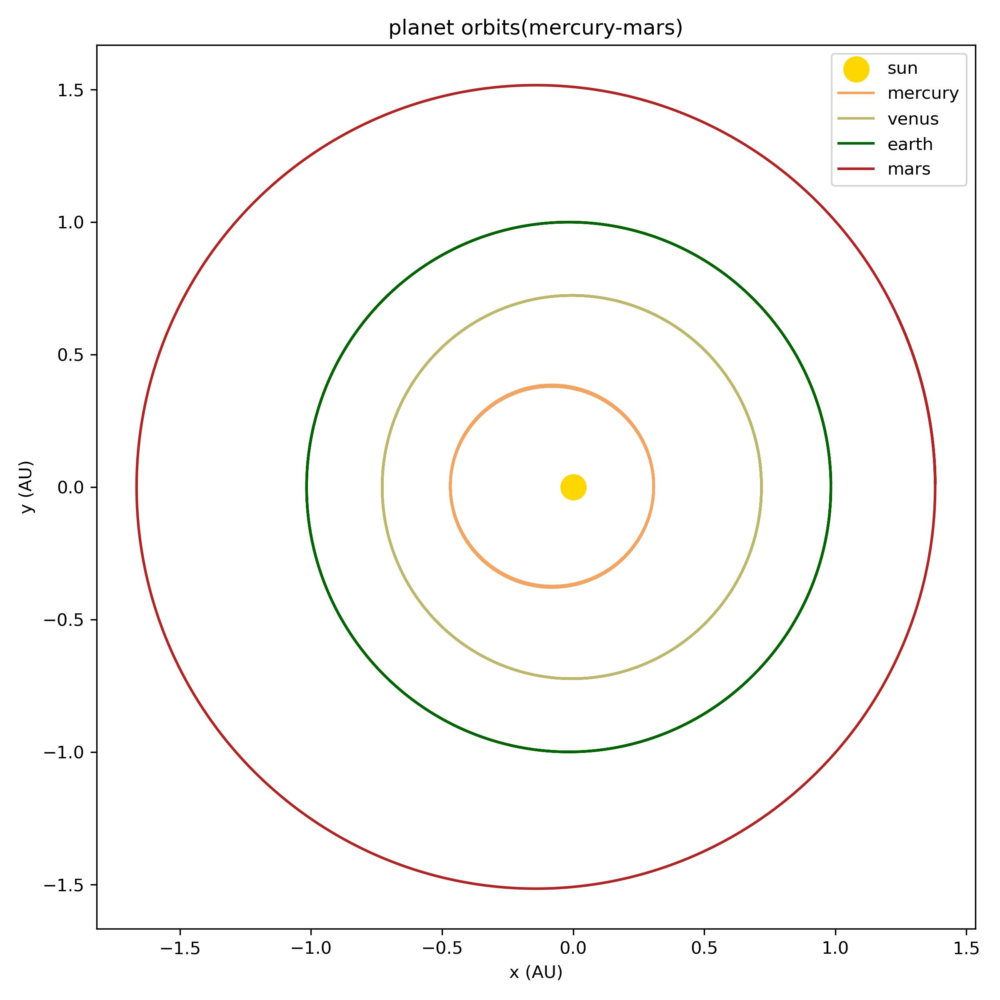

# Solar System N-body Simulation
A simple Python/NumPy Verlet integrator that models the gravitational orbits of the planets in the Solar System. Outputs are static plots of each planet's trajectory relative to the Sun over a configurable timespan (default: t = 190 yrs).

## Results
Below are the two plots generated.

All orbits over 190 yr

Orbits of Mercury-Mars over 2 yr

